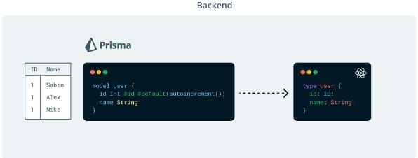

# What I learned during this project:

## Component vs Function call approach

Component Approach (<UserDisplay user={user} key={i}/>): This is the standard React way of using components. It benefits from React's optimizations like reconciling and state management. Components can have lifecycle methods, hooks, and can be easily integrated with the rest of the React ecosystem.

Function Call (UserDisplay(user)): This is just a function call that returns JSX. It does not get treated as a React component, meaning you lose out on component lifecycle methods, state handling, and other React features. It's less conventional in React applications and may lead to unexpected behaviors in more complex scenarios.

The component approach is more idiomatic in React and provides more flexibility and integration with React's features. The function call approach is simpler but less powerful and can potentially lead to issues in complex applications.


## Small script trick

instead of doing : `node src/index.ts`

in my package.json I can add the following : `"dev": "ts-node-dev src/index.ts"`
and then I can use the command `npm run dev`, it will be the same as `node src/index.ts`

## Railway

Railway is an infrastructure platform where you can provision infrastructure, develop with that infrastructure locally, and then deploy to the cloud.

After the creation of my PostgreSQL DB and migration `npx prisma migrate dev --name init`, i got :


And after running `npx prisma db seed`:


## Prisma - Pothos - GraphQL


Prisma Models: Prisma is used to define your data models, like User and Message. These models are typically mapped to your database tables.

Pothos and GraphQL Types: Pothos can help to create GraphQL types based on your Prisma models. So for models like User and Message, corresponding GraphQL types will be created using Pothos.
Example of Code :

```ts
builder.prismaObject("User", {
    fields: t => ({
        id: t.exposeID("id"),
        name: t.exposeString("name"),
        messages: t.relation("messages")
    })
})
```

Manual Specification for Queries: you need to manually define the GraphQL queries (and mutations). These are the operations that allow clients to fetch (Query) or modify (Mutation) data. For instance, you would define a query to retrieve users in the GraphQL schema.

In essence, Pothos leverages your Prisma models to simplify the creation of GraphQL types, but the logic for how data is queried or mutated (the resolvers for queries and mutations) needs to be defined by you.


The Prisma schema defines the shape of the data in the database, while the GraphQL schema defines the data available in the API.

Quand on parle de schéma en graphql, on parle à la fois des types objets, des types query et des types mutations
Le schéma c'est un peu tout ce qu'on peut requêter / faire avec l'api


Along the way, We:

Set up a GraphQL server with GraphQL Yoga
Set up the Pothos schema builder
Defined your GraphQL object and query types
Queried for data using Prisma Client


## Something I wasn't aware of

 In JavaScript and TypeScript, when a module (in this case, models/Message and models/User) is imported, the code within that module is executed. This behavior is particularly useful in scenarios like this, where the purpose of the import is to ensure that certain configurations or definitions (such as those within your model files) are executed and registered before further use - in this case, before generating the GraphQL schema with builder.toSchema({}).


 


## GraphQL Codegen

Currently, Prisma generates a set of TypeScript types based off of our database schema. Pothos uses those types to help build GraphQL type definitions. The result of those two pieces is a GraphQL schema:

 


Our frontend project currently has a set of manually defined types.
If a new field is introduced, updated, or removed form the API, our frontend application would have no idea a change occurred in the API and the type definitions in the two projects would become out of sync.

GraphQL Codegen will generate TypeScript types and query helpers in your React project based off of our GraphQL schema and the queries we write in our frontend application.


## Workflow

Prisma will generate types based off of our database schema.
Pothos will use those types to expose GraphQL types via an API.
GraphQL Codegen will read your GraphQL schema and generate types for our frontend codebase representing what is available via the API and how to interact with it.


## Link to the tutorial 

https://www.prisma.io/blog/series/e2e-typesafety-graphql-react-yiw81oBkun