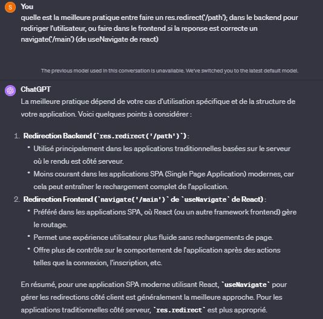

## Summary of the project

In this project, we have :
- technical stack: React on the front, NodeJS with Express and Passport, MongoDB atlas and mongoose
- a login system of your choice: either via username / password or with facebook (I could have implemented google too, or twitter, but it's similar, you just need to see the passport doc)
- a JWT generation passed into the application not via the bearer token but via the httpOnly cookie

## Passport

Passport is authentication middleware for Node.js. Extremely flexible and modular, Passport can be unobtrusively dropped in to any Express-based web application. A comprehensive set of strategies support authentication using a username and password, Facebook, Twitter, and more.

Avec Passport, vous pouvez facilement basculer entre différentes stratégies d'authentification sans modifier la logique de l'application. 

https://www.passportjs.org/concepts/authentication/

## Sessions

A web application needs the ability to identify users as they browse from page to page. This series of requests and responses, each associated with the same user, is known as a `session`.

HTTP is a stateless protocol, meaning that each request to an application can be understood in isolation - without any context from previous requests. This poses a challenge for web applications with logged in users, as the authenticated user needs to be remembered across subsequent requests as they navigate the application.

To solve this challenge, web applications make use of sessions, which allow state to be maintained between the application server and the user's browser.


Applications must initialize session support in order to make use of login sessions. In an Express app, session support is added by using express-session middleware.

```js
app.use(session({
    secret: process.env.SESSION_SECRET,
    resave: false,
    saveUninitialized: false,
}))
```

To maintain a login session, Passport serializes and deserializes user information to and from the session. The information that is stored is determined by the application, which supplies a serializeUser and a deserializeUser function.


## JWT

In the frontend :
- To keep them secure, you should always store JWTs inside an httpOnly cookie. This is a special kind of cookie that's  only sent in HTTP requests to the server. It's never accessible (both for reading or writing) from JavaScript running in the browser


## Other

