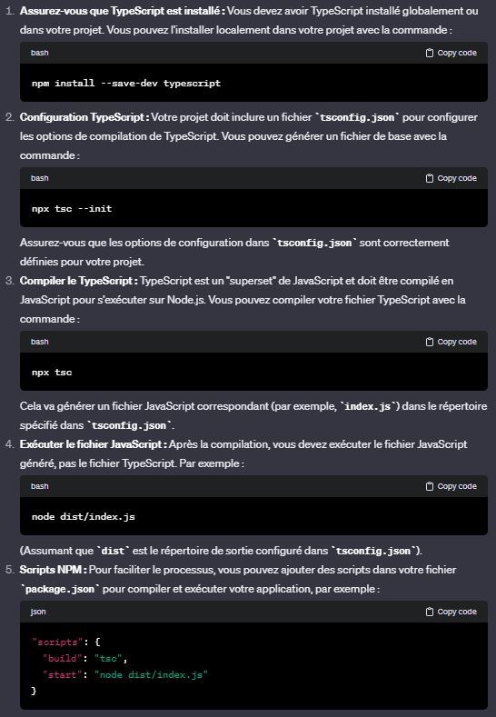
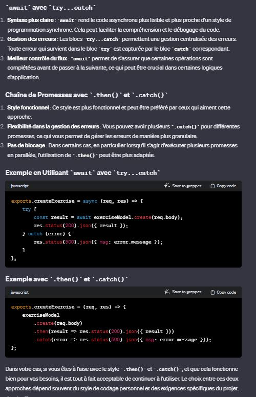
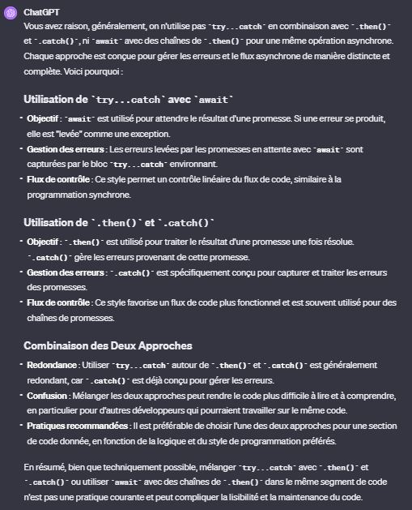
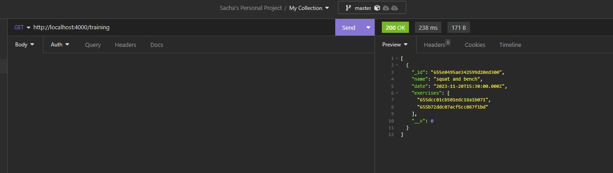

## Objectifs

Créer une application simple CRUD pour des exercises de sport en utilisant React pour le front et MongoDB avec Mongoose et une REST API côté back. Ensuite la partie la plus intéressante sera d'analyser les performances de l'application et d'utiliser un système comme Redis pour de la mise en cache, ou tester d'autres systèmes de mise en cache et analyser la performance de l'app.

## Typescript et Node

 TypeScript est un langage qui s'appuie sur JavaScript et ajoute des fonctionnalités de typage statique. Comme Node.js exécute du JavaScript standard, les fichiers TypeScript doivent être compilés en JavaScript avant de pouvoir être exécutés sur Node.js. L'outil tsc (TypeScript Compiler) est utilisé pour cette compilation.

  

## Discussion await avec try...catch et Chaîne de Promesses avec .then() et .catch()

Votre interrogation sur l'utilisation de await et try...catch versus les chaînes de promesses avec .then() et .catch() dans le contexte de la gestion des requêtes asynchrones en Node.js est tout à fait pertinente. Ces deux approches sont valides mais ont des différences de style et de fonctionnement.

## Queries

Si je requête mes trainings, je vais avoir ça :

Les exercices sont référencés par leurs ids dans chaque data training. 
In Mongoose (the MongoDB object modeling tool for Node.js), populate is a method that you can use for automatically replacing the specified paths in the document with document(s) from other collections. In your case, where you have references (_ids) to Exercise documents in your Training documents, you can use populate to fetch the full Exercise documents associated with each Training session.

Problème des N + 1 requêtes

## Others 

Typer req et res :
npm install @types/express --save-dev
import { Request, Response } from "express";
