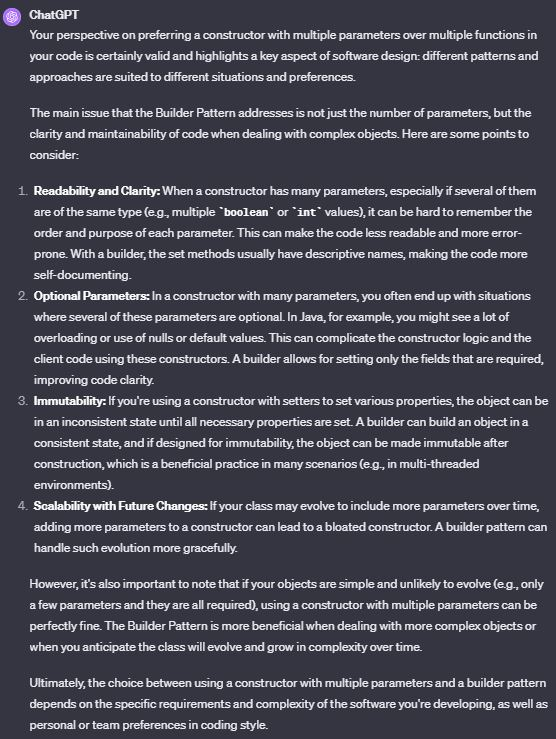

👷 Builder
--------------------------------------------
Real world example
> Imagine you are at Hardee's and you order a specific deal, lets say, "Big Hardee" and they hand it over to you without *any questions*; this is the example of simple factory. But there are cases when the creation logic might involve more steps. For example you want a customized Subway deal, you have several options in how your burger is made e.g what bread do you want? what types of sauces would you like? What cheese would you want? etc. In such cases builder pattern comes to the rescue.

In plain words
> Allows you to create different flavors of an object while avoiding constructor pollution. Useful when there could be several flavors of an object. Or when there are a lot of steps involved in creation of an object.

Wikipedia says
> The builder pattern is an object creation software design pattern with the intentions of finding a solution to the telescoping constructor anti-pattern.

Having said that let me add a bit about what telescoping constructor anti-pattern is. At one point or the other we have all seen a constructor like below:

```php
public function __construct($size, $cheese = true, $pepperoni = true, $tomato = false, $lettuce = true)
{
}
```

As you can see; the number of constructor parameters can quickly get out of hand and it might become difficult to understand the arrangement of parameters. Plus this parameter list could keep on growing if you would want to add more options in future. This is called telescoping constructor anti-pattern.

**When to use?**

When there could be several flavors of an object and to avoid the constructor telescoping. The key difference from the factory pattern is that; factory pattern is to be used when the creation is a one step process while builder pattern is to be used when the creation is a multi step process.


### Question to chatGPT :

"The builder pattern is an object creation software design pattern with the intentions of finding a solution to the telescoping constructor anti-pattern.

Having said that let me add a bit about what telescoping constructor anti-pattern is. At one point or the other we have all seen a constructor like below:

public function __construct($size, $cheese = true, $pepperoni = true, $tomato = false, $lettuce = true)
{
}"

i have a question about that. Is it really a problem? I think personnally as a developper i prefer having 10 params in a constructor than having 10 functions that take place in my code

### Response 




## Applicability

- **Use the Builder pattern to get rid of a “telescoping constructor”.**

 Say you have a constructor with ten optional parameters. Calling such a beast is very inconvenient; therefore, you overload the constructor and create several shorter versions with fewer parameters. These constructors still refer to the main one, passing some default values into any omitted parameters.
```ts
class Pizza {
    Pizza(int size) { ... }
    Pizza(int size, boolean cheese) { ... }
    Pizza(int size, boolean cheese, boolean pepperoni) { ... }
    // ...
```
Creating such a monster is only possible in languages that support method overloading, such as C# or Java.

The Builder pattern lets you build objects step by step, using only those steps that you really need. After implementing the pattern, you don’t have to cram dozens of parameters into your constructors anymore.

- **Use the Builder pattern when you want your code to be able to create different representations of some product (for example, stone and wooden houses).**

- **Use the Builder to construct Composite trees or other complex objects.**