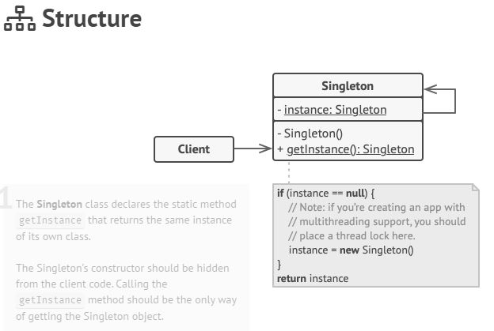

💍 Singleton
------------
Real world example
> There can only be one president of a country at a time. The same president has to be brought to action, whenever duty calls. President here is singleton.

In plain words
> Ensures that only one object of a particular class is ever created.

Wikipedia says
> In software engineering, the singleton pattern is a software design pattern that restricts the instantiation of a class to one object. This is useful when exactly one object is needed to coordinate actions across the system.

Singleton pattern is actually considered an anti-pattern and overuse of it should be avoided. It is not necessarily bad and could have some valid use-cases but should be used with caution because it introduces a global state in your application and change to it in one place could affect in the other areas and it could become pretty difficult to debug. The other bad thing about them is it makes your code tightly coupled plus mocking the singleton could be difficult.

All implementations of the Singleton have these two steps in common:

- Make the default constructor private, to prevent other objects from using the new operator with the Singleton class.
- Create a static creation method that acts as a constructor. Under the hood, this method calls the private constructor to create an object and saves it in a static field. All following calls to this method return the cached object.

If your code has access to the Singleton class, then it’s able to call the Singleton’s static method. So whenever that method is called, the same object is always returned.

## Applicability

- **Use the Singleton pattern when a class in your program should have just a single instance available to all clients; for example, a single database object shared by different parts of the program.**

- **Use the Singleton pattern when you need stricter control over global variables.**