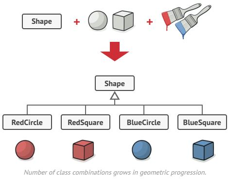

🚡 Bridge
------

Bridge is a structural design pattern that lets you split a large class or a set of closely related classes into two separate hierarchies—abstraction and implementation—which can be developed independently of each other.

##  Problem
Abstraction? Implementation? Sound scary? Stay calm and let’s consider a simple example.

Say you have a geometric Shape class with a pair of subclasses: Circle and Square. You want to extend this class hierarchy to incorporate colors, so you plan to create Red and Blue shape subclasses. However, since you already have two subclasses, you’ll need to create four class combinations such as BlueCircle and RedSquare.

Adding new shape types and colors to the hierarchy will grow it exponentially. For example, to add a triangle shape you’d need to introduce two subclasses, one for each color. And after that, adding a new color would require creating three subclasses, one for each shape type. The further we go, the worse it becomes.

## Solution
This problem occurs because we’re trying to extend the shape classes in two independent dimensions: by form and by color. That’s a very common issue with class inheritance.

The Bridge pattern attempts to solve this problem by switching from inheritance to the object composition. What this means is that you extract one of the dimensions into a separate class hierarchy, so that the original classes will reference an object of the new hierarchy, instead of having all of its state and behaviors within one class.

Solution suggested by the Bridge pattern

Following this approach, we can extract the color-related code into its own class with two subclasses: Red and Blue. The Shape class then gets a reference field pointing to one of the color objects. Now the shape can delegate any color-related work to the linked color object. That reference will act as a bridge between the Shape and Color classes. From now on, adding new colors won’t require changing the shape hierarchy, and vice versa.

## Applicability
- **Use the Bridge pattern when you want to divide and organize a monolithic class that has several variants of some functionality (for example, if the class can work with various database servers).**

 The bigger a class becomes, the harder it is to figure out how it works, and the longer it takes to make a change. The changes made to one of the variations of functionality may require making changes across the whole class, which often results in making errors or not addressing some critical side effects.

The Bridge pattern lets you split the monolithic class into several class hierarchies. After this, you can change the classes in each hierarchy independently of the classes in the others. This approach simplifies code maintenance and minimizes the risk of breaking existing code.

- **Use the pattern when you need to extend a class in several orthogonal (independent) dimensions.**

- **Use the Bridge if you need to be able to switch implementations at runtime.**