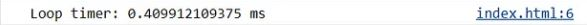
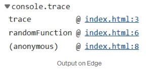
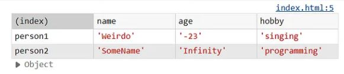

From https://medium.com/@anirudh.munipalli/stop-using-console-log-in-javascript-try-these-instead-72490d895a24

See more : https://developer.mozilla.org/en-US/docs/Web/API/console

# JavaScript Console Tips

Explore different ways to use the console in JavaScript for debugging and logging. This guide provides various methods beyond the basic `console.log` that can improve debugging and code understanding.

<br/>


## Console Warnings and Errors

Instead of the usual `console.log`, try these for more descriptive messages:

- `console.warn("This is a warning");` - for warnings
- `console.error("This is an error")` - for errors

<br/>


## Measure Execution Time

Use `console.time()` and `console.timeEnd()` to measure how long a piece of code takes to execute, especially useful in CPU-intensive applications.

```js
console.time("Loop timer")
for(i = 0; i < 10000; i++){
    // Some code here
}
console.timeEnd("Loop timer")
```

This is very useful in CPU intensive applications that would take some time


<br/>

## Tracing Code Execution
Want to see how a function was called? Trace the execution path of your functions using console.trace().


```js
function trace(){
    console.trace()
}
function randomFunction(){
    trace();
}
```



It shows that anonymous (which is the main JavaScript code) called randomFunction, which called trace().


<br/>

### Table
Imagine we have two objects.


```js
let person1 = {name: "Weirdo", age : "-23", hobby: "singing"}
let person2 = {name: "SomeName", age : "Infinity", hobby: "programming"}
```

Simply console.log would make the data look messy.

A table would be better. Present objects clearly using console.table() for better readability.



