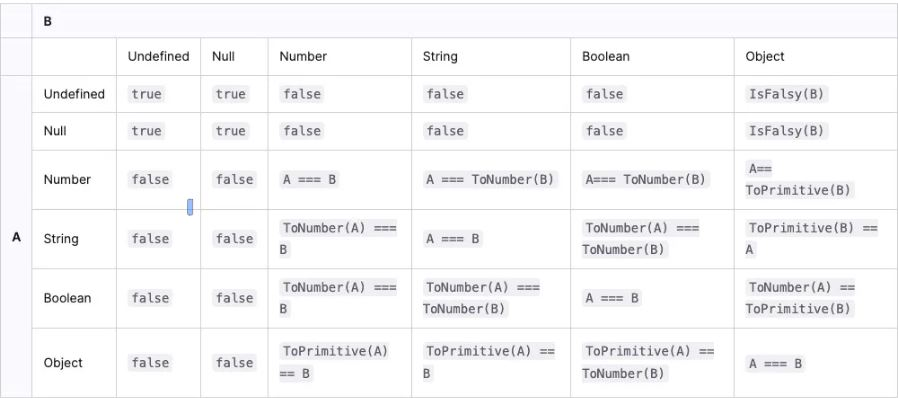

# Can (a==1 && a==2 && a==3) Ever Evaluate to ‘true’ in JavaScript?

When `==` is used to compare two values in JavaScript, the following operations are performed:

1. Convert the two compared values to the same type.

2. After conversion (one or both sides of the equation may be converted), compare the values.

Rules with undefined, null, string, booleans or int are kinda straightforward

But in our case :

The type of a is Object, which can be converted using the “conversion mechanism”.

When the object is converted to the original type, the built-in [ToPrimitive] function will be called. The logic is roughly as follows:

1. If there is a Symbol.toPrimitive method, call it first, otherwise 2.

2. Call valueOf, if it can be converted to the original type, return, otherwise

3. Call toString, if it can be converted to the original type, return, otherwise, 4.

4. If the original type is not returned, an error will be reported.

 

For the **solution 3** of our question that uses the with keyword :

The with keyword in JavaScript is used to extend the scope of object strings within a specific block of code. However, it's important to note that the use of with is generally discouraged, as it can make code more difficult to read and debug. Furthermore, with is not permitted in JavaScript's use strict mode.

 

**About Solution 3:**

we define a new property a on the global window object. window is a global object that represents the browser window in web programming environments.

The "a" property is defined with a "getter". A getter is a function that is executed each time the property is accessed. In this case, each time a is accessed, the get() function is called.

Only possible in front (object window doesn't exist in backend)

 

**About Solution 4:**

Proxies in JavaScript are an advanced feature that allows you to create an object that "wraps" or "encapsulates" another object or function. A proxy can intercept and redefine fundamental operations for the target object, such as reading properties, assigning values, enumerating properties and so on.

