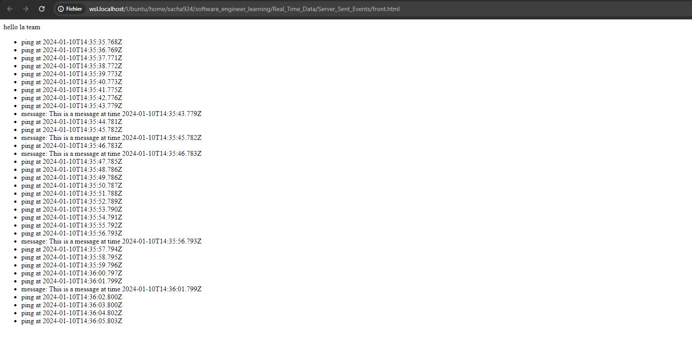

# Server Sent Events Demo

EventSource API Source:
The EventSource API is a native browser feature, and you don't need to install anything separately to use it. It's automatically available in modern web browsers, and you can use it in your JavaScript code without additional installations or dependencies. The browser provides this API for handling Server-Sent Events (SSE) and managing server-sent event streams.

Preview of the final result :

When you launch the html you have nothing, and each second you receive a ping and sometimes a message.