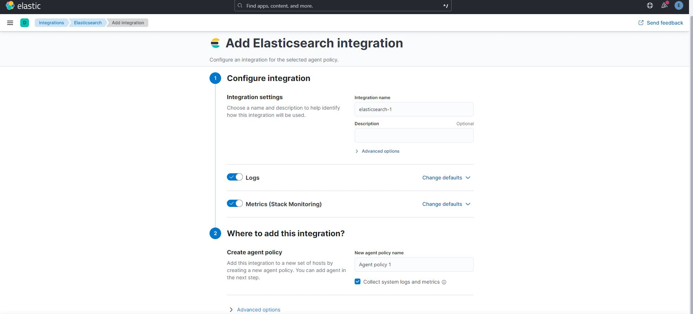
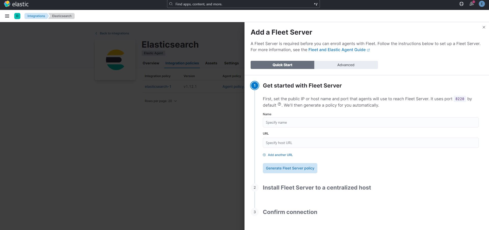
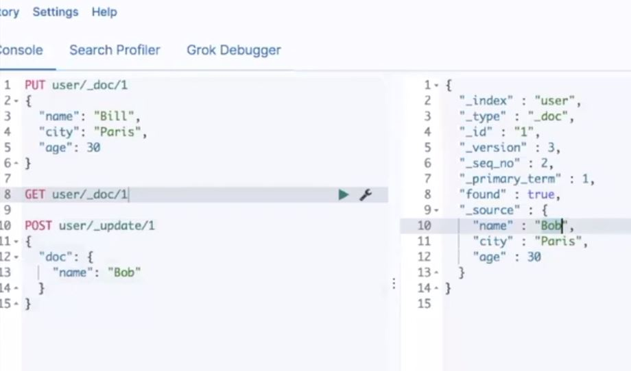
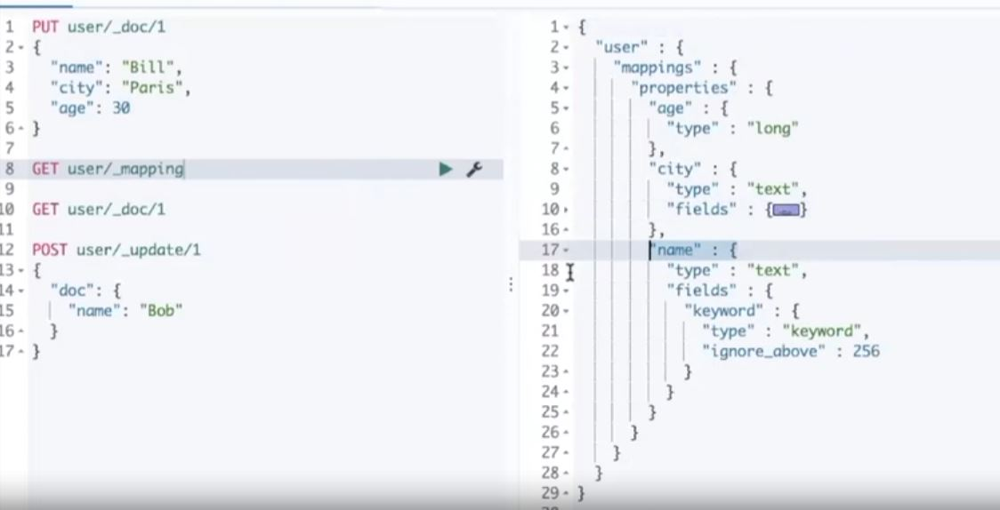
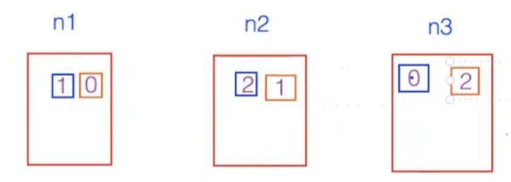
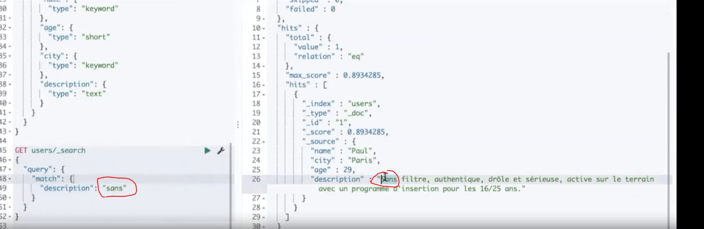
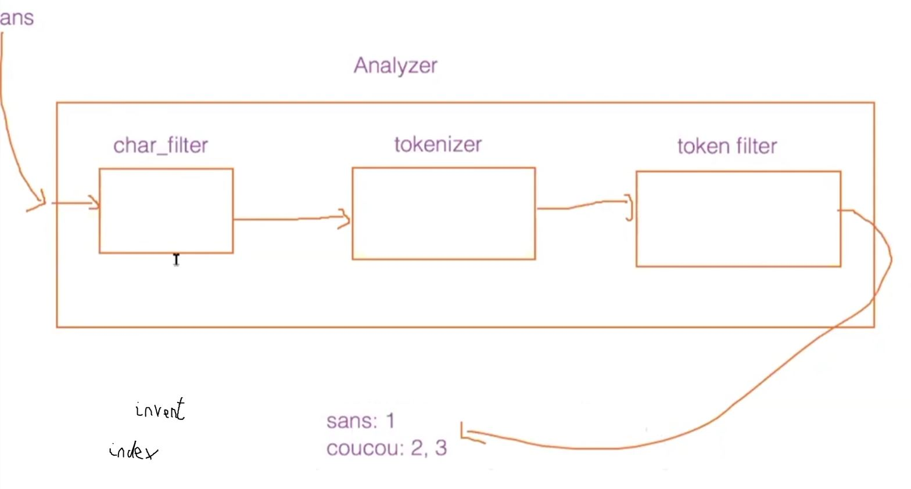

# Guide d'Utilisation d'Elasticsearch et Kibana

Ce document présente une introduction à l'utilisation d'Elasticsearch et Kibana, en se concentrant sur leur installation, configuration, et concepts clés.

## Notes

je me suis rendu compte qu'un "search engine" comme Elasticsearch est conçu pour stocker, indexer et rechercher des données de manière efficace.

stack elastic : 4 logiciel

elastic search 

Beasts et Logstash qui permettent d’insérer des données, la partie ingest layer

Toutes nos données vont allées sur elasticsearch,

Et ensuite on va pouvoir utiliser un outil qui s’appelle Kibana

Kibana c’est la fenêtre sur la stack, on va pouvoir visualiser nos données, manager la stack, faire du monitoring…

On peut déployer la stack elastic de différente manière : saas (dans le cloud), ou self-managed

### Installation

Installation de Elasticsearch et Kibana :

- [Elasticsearch](https://www.elastic.co/fr/downloads/elasticsearch)
- [Kibana](https://www.elastic.co/fr/downloads/kibana)

Ensuite il faudra dézipper, lancer le fichier bat dans le bin et suivre les étapes demandées pour configurer kibana avec elastic

### Partie découverte

Comme je suis quelqu'un de flemmard et que je me suis rendu compte qu'utiliser le cloud allait m'éviter tous les soucis de configuration je vais passer par le cloud =D

Données dans elasticsearch au format document

Index, deux concepts importants :
- **Distribution des données**
- **Mapping**: Le schéma de vos données dans Elasticsearch. Bien qu'Elasticsearch puisse générer automatiquement un mapping, il est possible de le récupérer et le personnaliser.

Dans nos requetes de l'image 3 on n'a pas spécifié le schéma de nos données et on pourrait penser que elasticsearch est schemaless, mais ce n'est pas le cas: à chaque fois que l'on va indexer un document dans un index elasticsearch va tenter de générer automatiquement un schéma pour nous.
On va pouvoir récupérer ce schéma, aussi appelé mapping, en utilisant le endpoint mapping :

Quand j'ai créé mon index, elasticsearch a créé des shard pour distribuer les données. Par défaut elasticsearch créé 1 shard par index

shard et copie : un shart et sa copie ne se trouve jamais sur le meme noeud

- **Shard**: Unité de stockage d'Elasticsearch. Chaque index est divisé en shards pour une distribution efficace des données.
- **Copies**: Chaque shard a sa copie pour assurer la redondance et la disponibilité des données.

On peut voir que dans ma requête même si je met un s en lower case, ca peut me trouver la description qui contient le mot Sans avec une uppercase pour le s, pourquoi ?

On va avoir une analyse du texte qui va être faite. Mon texte va entré dans un analyser, qui contient 3 parties :
1. **Character Filter**: Transformation de texte, par exemple, suppression des balises HTML.
2. **Tokenizer**: Découpage du texte en mots ou tokens.
3. **Token Filter**: Transformation des tokens, comme supprimer les majuscules.

Dans Elasticsearch, l'agrégation permet d'analyser et de résumer les données de manière avancée. Les agrégations sont similaires aux opérations de groupe (GROUP BY) que l'on trouve dans les bases de données relationnelles, mais elles sont conçues pour fonctionner avec des données non structurées ou semi-structurées, telles que des documents JSON.

