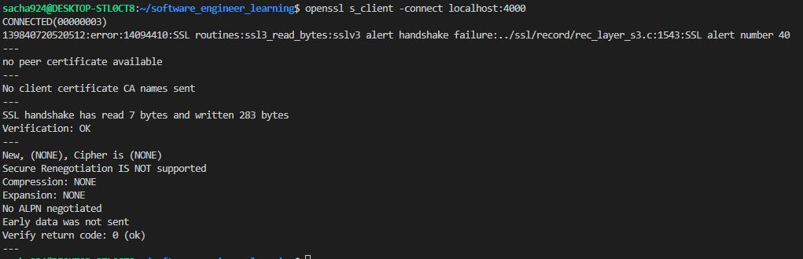
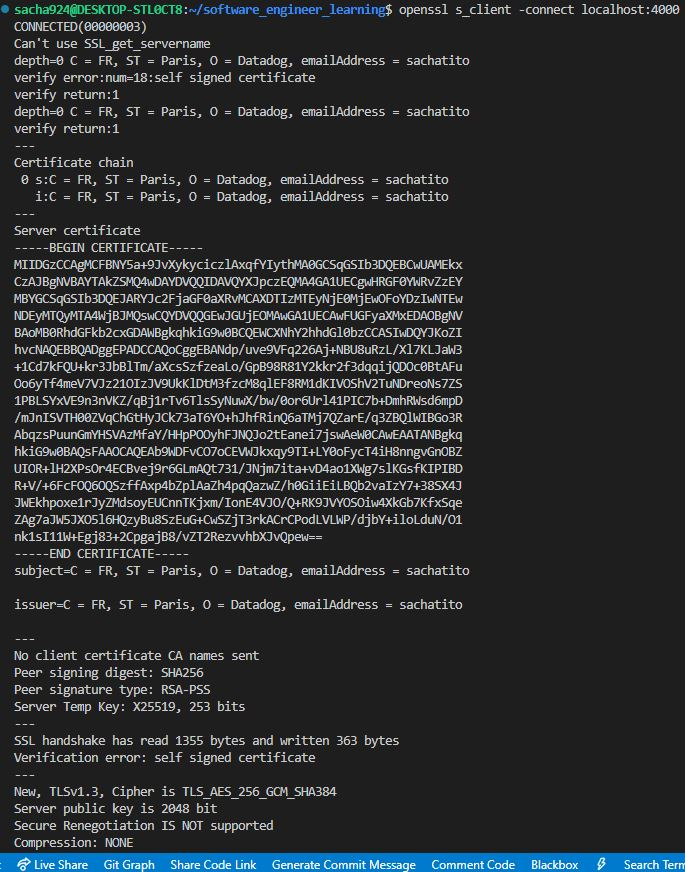

# TLS

Le TLS est un protocole de chiffrement conçu pour sécuriser les communications Internet. La négociation TLS (également nommée handshake) désigne le processus qui amorce une session de communication utilisant le chiffrement TLS. Au cours de cette négociation, les deux parties communicantes s'échangent l'une l'autre des messages d'authentification et de vérification, établissent les algorithmes de chiffrement qu'elles utiliseront et se mettent d'accord sur les clés de session. Cette négociation constitue un élément fondamental du fonctionnement du protocole HTTPS.

---------------
<br/>

## À quel moment une négociation TLS intervient-elle ?

Une négociation TLS a lieu chaque fois qu'un utilisateur accède à un site web via HTTPS et que le navigateur commence à interroger le serveur d'origine du site web. Cette négociation intervient également chaque fois que d'autres communications utilisent le protocole HTTPS, y compris les appels d'API et les requêtes DNS sur HTTPS.

Les négociations TLS se produisent après l'ouverture d'une connexion TCP par l'intermédiaire d'une négociation TCP.


---------------
<br/>

## Que se passe-t-il lors d'une négociation TLS ?
Au cours d'une négociation TLS, le client et le serveur effectuent ensemble les opérations suivantes :

- Préciser quelle version de TLS (TLS 1.0, 1.2, 1.3, etc.) ils utiliseront.
- Décider quelles suites de chiffrement ils utiliseront.
- Authentifier l'identité du serveur à l'aide de la clé publique du serveur et de la signature numérique de l'autorité de certification SSL.
- Générer des clés de session afin d'utiliser le chiffrement symétrique une fois la négociation terminée.


---------------
<br/>

## Les étapes du handshake

La négociation TLS se compose d'une série de datagrammes (ou messages) échangés par un client et un serveur. Les étapes exactes d'une poignée de main TLS varient en fonction du type d'algorithme d'échange de clés utilisé et des suites de chiffrement prises en charge par les deux parties.
 Cela se passe à peu près comme suit :

1. Message « Client Hello » : le client démarre la négociation en envoyant un message « Hello » au serveur. Le message inclut la version TLS prise en charge par le client, les suites de chiffrement prises en charge et une chaîne d'octets aléatoires connue sous le nom de « client random », ou nombre aléatoire client.

2. Message « Server Hello » : en réponse au message Client Hello, le serveur envoie un message contenant le certificat SSL du serveur, la suite de chiffrement choisie par le serveur et le « Server random », une autre chaîne aléatoire d'octets générée par le serveur.

3. Authentification : le client vérifie le certificat SSL du serveur auprès de l'autorité de certification qui l'a émis. Cette opération confirme que le serveur est bien celui qu'il prétend être et que le client interagit avec le véritable propriétaire du domaine.

4. Secret pré-maître : le client envoie une autre chaîne d'octets aléatoire, le « premaster secret », ou secret pré-maître. Le secret pré-maître est chiffré à l'aide de la clé publique et ne peut être déchiffré par le serveur qu'avec la clé privée. (Le client obtient la clé publique dans le certificat SSL du serveur.)

5. Utilisation de la clé privée : le serveur déchiffre le secret pré-maître.

6. Création des clés de session : le client et le serveur génèrent des clés de session à partir du client random, du server random et du secret pré-maître. Ils doivent aboutir aux mêmes résultats.

7. Client prêt : le client envoie un message « Client Finished » chiffré à l'aide d'une clé de session.

8. Serveur prêt : le serveur envoie un message « Server Finished » chiffré à l'aide d'une clé de session.

9. Chiffrement symétrique sécurisé effectué : la négociation est terminée et la communication se poursuit à l'aide des clés de session.


---------------
<br/>

## Qu'est-ce qui est différent d'une poignée de main dans TLS 1.3 ?
TLS 1.3 ne prend pas en charge RSA, ni d'autres suites de chiffrement et paramètres qui sont vulnérables aux attaques. Il raccourcit également la poignée de main TLS, ce qui rend la poignée de main TLS 1.3 à la fois plus rapide et plus sûre.

Les étapes de base d'une poignée de main TLS 1.3 sont les suivantes :

<br/>

1. Message d'accueil du client : le client envoie un message d'accueil du client contenant la version du protocole, le hasard du client et une liste de suites de chiffrement.La prise en charge des suites de chiffrement non sécurisées ayant été supprimée de TLS 1.3, le nombre de suites de chiffrement possibles est considérablement réduit.Le bonjour du client comprend également les paramètres qui seront utilisés pour calculer le secret du prémaître.Essentiellement, le client suppose qu'il connaît la méthode d'échange de clés préférée du serveur (ce qui est probablement le cas, étant donné la liste simplifiée des suites de chiffrement).Cela réduit la longueur totale de la poignée de main - l'une des différences importantes entre les poignées de main TLS 1.3 et les poignées de main TLS 1.0, 1.1 et 1.2.


2. Le serveur génère le secret principal : à ce stade, le serveur a reçu les paramètres et les suites de chiffrement aléatoires du client.Il possède déjà le serveur aléatoire, puisqu'il peut le générer lui-même. Par conséquent, le serveur peut créer le secret principal.

3. Serveur hello et « Fini »: le serveur hello comprend le certificat du serveur, la signature numérique, le serveur aléatoire et la suite de chiffrement choisie.Comme il possède déjà le secret maître, il envoie également un message « Fini ».

4. Étapes finales et client « Fini »: le client vérifie la signature et le certificat, génère le secret maître et envoie le message « Fini ».

5. Chiffrement symétrique sécurisé effectué


## Application test

j'ai créé une application réact ainsi qu'un server avec express.js 

Création du SSL Certificate :

1. First, generate a key file used for self-signed certificate generation with the command below. The command will create a private key as a file called key.pem.

```
openssl genrsa -out key.pem
```

2. Next, generate a certificate service request (CSR) with the command below. You’ll need a CSR to provide all of the input necessary to create the actual certificate.

```
openssl req -new -key key.pem -out csr.pem
```

3. Finally, generate your certificate by providing the private key created to sign it with the public key created in step two with an expiry date of 9,999 days. This command below will create a certificate called cert.pem.

```
openssl x509 -req -days 9999 -in csr.pem -signkey key.pem -out cert.pem
```


quand je vais sur https://localhost:4000 je peux voir la réponse de mon serveur, même si je dois d'aborc accepter un message me disant que ma connection n'est pas sécurisé.

Depuis mon application react par contre quand je fais un fetch, j'ai m'erreur net::ERR_CERT_AUTHORITY_INVALID indique que le navigateur ne fait pas confiance au certificat SSL utilisé par votre serveur, probablement parce qu'il est auto-signé. Dans un environnement de développement, c'est une situation courante. 

je vais donc intéragir avec mon serveur/API directement depuis mon browser et non mon application react.

Partie utilisation de Https done. Maintenant on va un peu analyser ce qu'il se passe.


> openssl s_client -connect localhost:4000

sans passer les options de certificat (en gros le https peut pas fonctionner car on a pas le certificat)


avec certificat :




On peut aussi utiliser wireshark.

## Différence Wireshark / JA3


Le fingerprint TLS, souvent réalisé via une bibliothèque comme JA3, est une méthode pour identifier de manière unique la configuration TLS d'un client. Cela inclut les détails sur la version TLS utilisée, les suites de chiffrement proposées, et d'autres extensions TLS spécifiques. L'analyse du fingerprint TLS et celle effectuée via Wireshark sont liées mais servent des objectifs légèrement différents.

## Analyse avec Wireshark

Objectif: Wireshark est utilisé pour capturer et analyser les paquets réseau, y compris le protocole TLS.

Fonctionnalité: Il permet de visualiser chaque étape du handshake TLS, de voir les messages échangés, les certificats utilisés, les suites de chiffrement négociées, etc.

Utilisation: C'est un outil puissant pour le débogage, l'analyse de performance, ou la compréhension détaillée des interactions réseau.


## Fingerprint TLS avec JA3

Objectif: JA3 crée un fingerprint (empreinte digitale) des paramètres TLS utilisés lors de la négociation TLS (handshake).

Fonctionnalité: Cette empreinte est générée en prenant en compte des éléments comme la liste des suites de chiffrement, l'ordre dans lequel elles sont proposées, la version TLS, et d'autres extensions.

Utilisation: Ce fingerprint est souvent utilisé à des fins de sécurité, comme la détection d'activités malveillantes, le tracking de clients spécifiques, ou la mise en œuvre de contrôles de sécurité basés sur les configurations TLS connues.


## Lien entre les Deux

Complémentarité: Alors que Wireshark vous donne une vue détaillée de ce qui se passe au niveau du protocole, JA3 vous fournit un moyen de résumer et d'identifier de manière unique la configuration TLS d'un client.


https://nodejs.org/api/tls.html

## https.createServer vs tls.createServer

1. https.createServer

Utilisation Principale: https.createServer est spécifiquement conçu pour créer un serveur HTTP sécurisé sur SSL/TLS. Il est principalement utilisé pour servir des pages web et gérer des requêtes HTTP/HTTPS.

Simplicité: Il offre une interface simplifiée pour la mise en place d'un serveur HTTPS, en gérant les détails de bas niveau de la communication TLS/SSL.
API HTTP: Il intègre étroitement avec l'API HTTP de Node.js, rendant la création d'un serveur web sécurisé relativement simple et directe.


2. tls.createServer

Utilisation Principale: tls.createServer est une interface de bas niveau pour créer un serveur TLS/SSL. Il peut être utilisé pour n'importe quel type de communication sécurisée basée sur TLS/SSL, pas seulement pour HTTP.

Flexibilité: Il offre plus de flexibilité et de contrôle sur la manière dont la communication TLS/SSL est gérée. Vous pouvez l'utiliser pour des protocoles autres que HTTP.

Complexité: La mise en place d'un serveur avec tls.createServer peut être plus complexe, car vous devez gérer vous-même plus de détails de bas niveau.


3. Choix entre les deux

Pour un Serveur Web: Si vous créez un serveur web classique pour servir des pages web sur HTTPS, https.createServer est généralement le choix le plus approprié.
Pour Autres Protocoles: Si vous avez besoin de sécuriser un protocole autre que HTTP, ou si vous avez besoin de plus de contrôle sur la manière dont la communication TLS/SSL est gérée, tls.createServer serait plus approprié.

En résumé, bien que les deux méthodes permettent de créer des serveurs sécurisés avec SSL/TLS, https.createServer est optimisé pour les applications web HTTPS, tandis que tls.createServer offre une approche plus flexible et de bas niveau, utile pour une plus grande variété de cas d'utilisation en dehors des serveurs web HTTP/HTTPS classiques.


